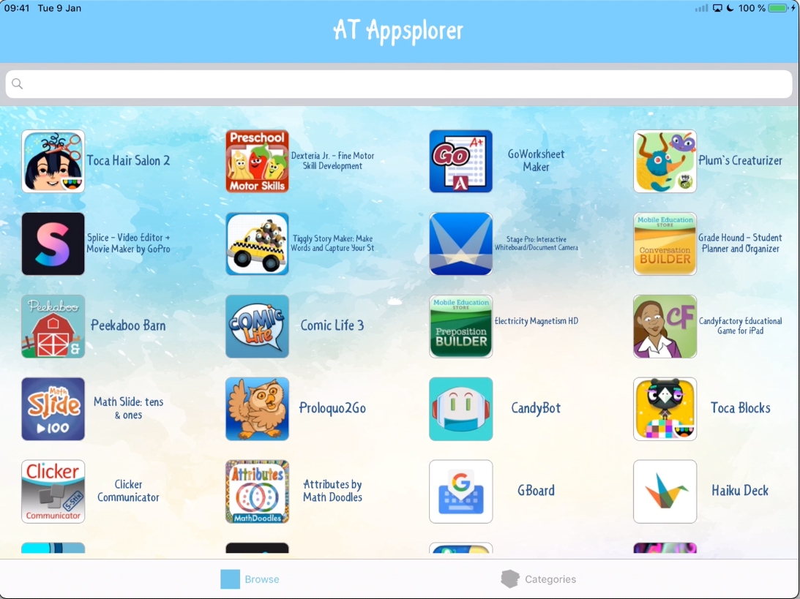

# AT App Finder
iPad App containing a library of searchable, categorised educational/assistive technology apps.

## Table of Contents
* [Description](#description)
* [Screenshot](#screenshot)
* [Code](#code)
* [Contact](#contact)
* [Technologies](#technologies)
* [Project Status](#project-status)

## Description 
This project was created for enterprise deployment through JAMF in a K-12 educational setting.  It contains a library of educational and assistive technology apps available for use within the district. Apps can be searched and also viewed by category.  Firebase is used to store the database.

## Screenshot

## Code
[GitHub Code Repository](https://github.com/Johny49/atappfinder)

## Contact 
Created by [@johny49](https://github.com/Johny49/) - feel free to contact me!

## Technologies
- Swift
- CocoaPods
- Firebase
- Alamofire

## Project Status
Project is: archived

